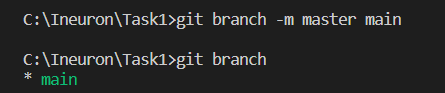
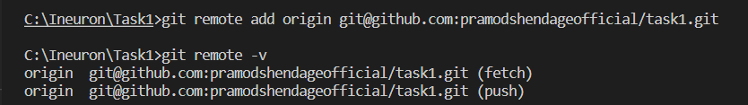

**Assignment**

1. **git init** : Command used to initialize a new repository.

   

2. **git config** : Command used to set the user name and user email to be used with commits. Also you can use to know the user name and email, setted in config

   
   
   Also you can use to know the user name and email, setted in config
   
   

3. **git clone** : Command used to obtain respository from an existing git url

    

4. **git branch** : Command used to list all the branches in current repository.

    

    You can use "git branch -m master main" command to create new branch and move all the history from master branch to new main brnach.

    

    You can use "git branch branch_name" command to create new branch "branch_name"

    

    You can use "git branch -d branch_name" command to delete the branch

    

5. **git remote add origin** : command used to creates a new remote called origin located at git@github.com:pramodshendageofficial/task1.git. 
    Once you do this, in your push commands, you can push to origin instead of typing out the whole URL.

    

6. **git status** : Command used to list all the files that have to be committed.

    

7. **git add** : Command used to add modified files to stagging area.

    

   You can also use . or * to select all the files

    

8. **git commit** : Command used to commit the files in the version history

    

9. **git push** : Command used to sends/push the committed changes of master branch to remote repository.

    

10. **git pull** : Command used to fetch/pull the changes on the remote server to your working directory.

    

11. **git checkout** : Command used to switch from one branch to another

    

12. **git merge** : Command used to merge the specified branch changes/history into the current branch.

    
    
13. **git log** : Command used to list the version history of current branch.

    

14. **git diff** : Command used to show the file difference which are not yet staged.
    
    

15. **git rm** : Command used to delete the file from working directory and stages the deletion.

